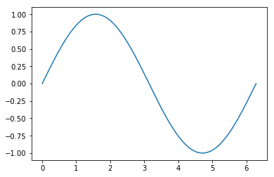
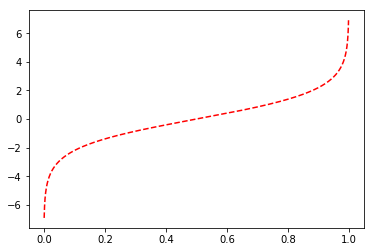
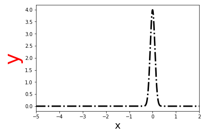
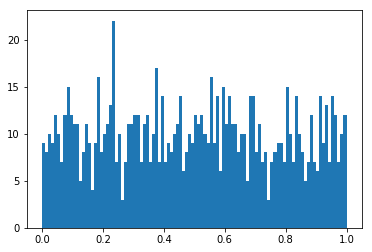
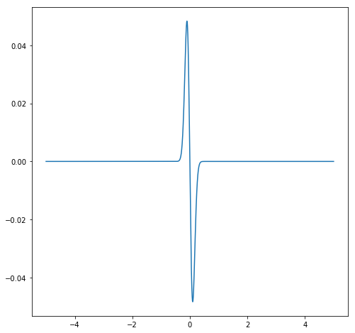
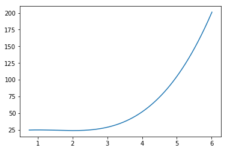
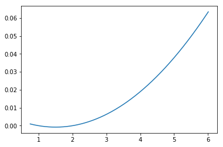
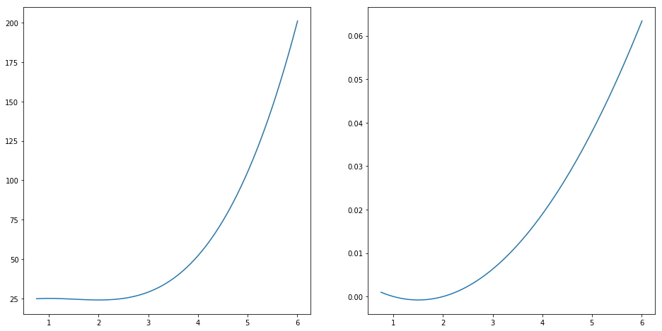
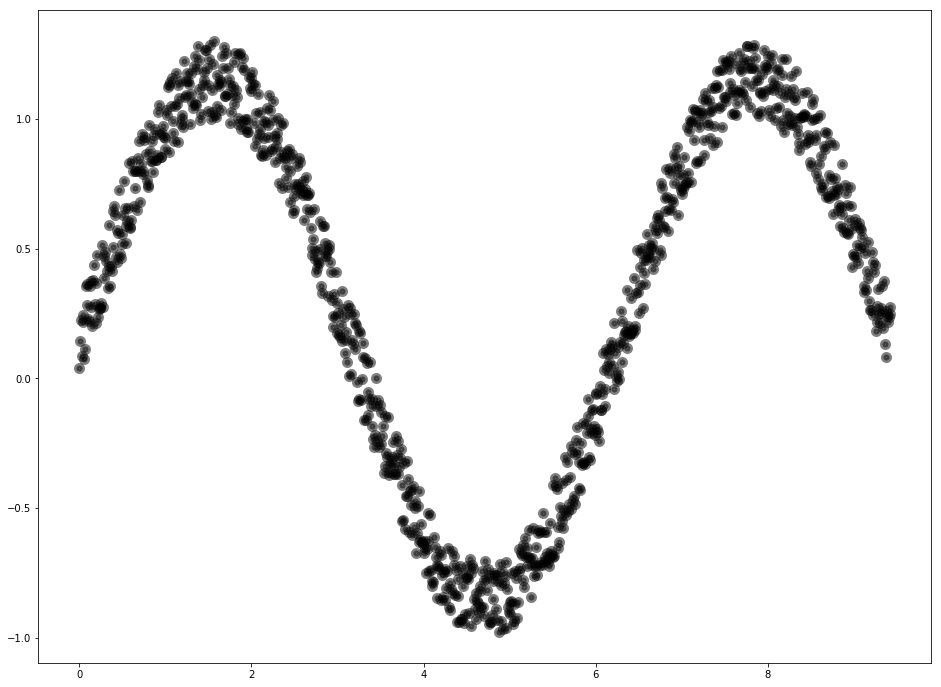

# Sesion 2 
## Help: [Ayudas y manuales de referencias](https://www.journaldev.com/22892/python-help-function)
Python help() function is used to get the documentation of specified module, class, function, variables etc. This method is generally used with python interpreter console to get details about python objects.


```python
help(range)
```


```python
?print
```


```python
input?
```

## [Arrays: Manejo de Indices](https://docs.scipy.org/doc/numpy/reference/arrays.indexing.html)
ndarrays can be indexed using the standard Python x[obj] syntax, where x is the array and obj the selection. There are three kinds of indexing available: field access, basic slicing, advanced indexing. Which one occurs depends on obj.


```python
import numpy as np

x = np.arange(0,16).reshape((4,4))
x.view()
```


    array([[ 0,  1,  2,  3],
           [ 4,  5,  6,  7],
           [ 8,  9, 10, 11],
           [12, 13, 14, 15]])


```python
x[1,1]
```


    5


```python
x[:,0]
```


    array([ 0,  4,  8, 12])


```python
x[:,1]
```


    array([ 1,  5,  9, 13])


```python
x[-1,-1]
```


    15


```python
x[[0,1],:]
```


    array([[0, 1, 2, 3],
           [4, 5, 6, 7]])


```python
x[:,0:-1]
```


    array([[ 0,  1,  2],
           [ 4,  5,  6],
           [ 8,  9, 10],
           [12, 13, 14]])


```python
x[:,0:-2]
```


    array([[ 0,  1],
           [ 4,  5],
           [ 8,  9],
           [12, 13]])


```python
x[:,0:-3].T
```


    array([[ 0,  4,  8, 12]])


## [Numpy: Random](https://docs.scipy.org/doc/numpy/reference/random/index.html)
Numpy’s random number routines produce pseudo random numbers using combinations of a BitGenerator to create sequences and a Generator to use those sequences to sample from different statistical distributions:

For convenience and backward compatibility, a single RandomState instance’s methods are imported into the numpy.random namespace, see Legacy Random Generation for the complete list.


```python
x = np.random.rand(16).reshape((4,4))
x
```


    array([[ 0.91152782,  0.03676717,  0.61166757,  0.93501542],
           [ 0.0453392 ,  0.52104111,  0.82342415,  0.49422168],
           [ 0.88302159,  0.5703287 ,  0.20753445,  0.13224936],
           [ 0.34955568,  0.63986411,  0.16524922,  0.39157167]])


```python
x.mean()
```


    0.48239868005784003


```python
x.min()
```


    0.036767165019904402


```python
x.max()
```


    0.93501541853916637


```python
x.argmax()
```


    3


```python
x.shape
```


    (4, 4)


```python
x.nonzero()
```


    (array([0, 0, 0, 0, 1, 1, 1, 1, 2, 2, 2, 2, 3, 3, 3, 3]),
     array([0, 1, 2, 3, 0, 1, 2, 3, 0, 1, 2, 3, 0, 1, 2, 3]))


```python
x.ravel()
```


    array([ 0.91152782,  0.03676717,  0.61166757,  0.93501542,  0.0453392 ,
            0.52104111,  0.82342415,  0.49422168,  0.88302159,  0.5703287 ,
            0.20753445,  0.13224936,  0.34955568,  0.63986411,  0.16524922,
            0.39157167])


```python
z=np.ones((3,3,3,3))
z
```


    array([[[[ 1.,  1.,  1.],
             [ 1.,  1.,  1.],
             [ 1.,  1.,  1.]],
    
            [[ 1.,  1.,  1.],
             [ 1.,  1.,  1.],
             [ 1.,  1.,  1.]],
    
            [[ 1.,  1.,  1.],
             [ 1.,  1.,  1.],
             [ 1.,  1.,  1.]]],
    
    
           [[[ 1.,  1.,  1.],
             [ 1.,  1.,  1.],
             [ 1.,  1.,  1.]],
    
            [[ 1.,  1.,  1.],
             [ 1.,  1.,  1.],
             [ 1.,  1.,  1.]],
    
            [[ 1.,  1.,  1.],
             [ 1.,  1.,  1.],
             [ 1.,  1.,  1.]]],
    
    
           [[[ 1.,  1.,  1.],
             [ 1.,  1.,  1.],
             [ 1.,  1.,  1.]],
    
            [[ 1.,  1.,  1.],
             [ 1.,  1.,  1.],
             [ 1.,  1.,  1.]],
    
            [[ 1.,  1.,  1.],
             [ 1.,  1.,  1.],
             [ 1.,  1.,  1.]]]])


```python
z[1,1,1,1]
```


    1.0


## [Markdown](https://daringfireball.net/projects/markdown/)
Markdown is a text-to-HTML conversion tool for web writers. Markdown allows you to write using an easy-to-read, easy-to-write plain text format, then convert it to structurally valid XHTML (or HTML).

Thus, “Markdown” is two things: (1) a plain text formatting syntax; and (2) a software tool, written in Perl, that converts the plain text formatting to HTML. See the Syntax page for details pertaining to Markdown’s formatting syntax. You can try it out, right now, using the online Dingus.

### Type of Fonts

Emphasis, aka italics, with *asterisks* or _underscores_.

Strong emphasis, aka bold, with **asterisks** or __underscores__.

Combined emphasis with **asterisks and _underscores_**.

Strikethrough uses two tildes. ~~Scratch this.~~

[I'm an inline-style link](https://www.google.com)

### Code highlight
An example of highligthing in javascript is:
```javascript
var s = "JavaScript syntax highlighting";
alert(s);
```
 An example of highligthing in python is:
```python
s = "Python syntax highlighting"
print s
```
Many other languages like bash, perl or html are possible to highlight


### Tables

Colons can be used to align columns.

| Tables        | Are           | Cool  |
| ------------- |:-------------:| -----:|
| col 3 is      | right-aligned | $1600 |
| col 2 is      | centered      |   $12 |
| zebra stripes | are neat      |    $1 |

There must be at least 3 dashes separating each header cell.
The outer pipes (|) are optional, and you don't need to make the 
raw Markdown line up prettily. You can also use inline Markdown.

Markdown | Less | Pretty
--- | --- | ---
*Still* | `renders` | **nicely**
1 | 2 | 3

## User Defined Functions


```python
def func(x):
    return x*np.sin(x)
```


```python
def logit(x):
    return np.log(x/(1.- x))
```


```python
def GaussDist(x,sigma,mu):
    return np.exp(-((x-mu)**2.)/(2.*sigma**2.))/(sigma*np.sqrt(2.*np.pi))
```

## Graficador: [Matplotlib](https://matplotlib.org/)
Matplotlib is a Python 2D plotting library which produces publication quality figures in a variety of hardcopy formats and interactive environments across platforms. Matplotlib can be used in Python scripts, the Python and IPython shells, the Jupyter notebook, web application servers, and four graphical user interface toolkits.


```python
import matplotlib.pyplot as plt
```

### curvas


```python
x = np.linspace(0,2*np.pi,5000)
y = np.sin(x)

plt.figure()
plt.plot(x,y)

plt.show()
```





```python
x = np.linspace(0.001,0.999,5000)
y = logit(x)

plt.figure()
plt.plot(x,y,'r--')
plt.show()
```





```python
x = np.linspace(-5,5,5000)
y = GaussDist(x,0.1,0.)
plt.figure(figsize=(6,4))
plt.plot(x,y,'k-.',lw=3)
plt.xlabel('x',fontsize=20)
plt.ylabel('y',fontsize=40,color='r')
plt.xlim(-5,2)
plt.show()
```





### Histogramas


```python
x=np.random.rand(1000)
plt.hist(x,100)
plt.show()
```





```python
x = np.linspace(-5,5,5000)
y = GaussDist(x,0.1,0.)
dydx = np.gradient(y)


plt.figure(figsize=(6,4))
plt.plot(x,y,'k-.',lw=3)
plt.xlabel('x',fontsize=20)
plt.ylabel('y',fontsize=40,color='r')
plt.xlim(-5,2)
plt.show()
```


```python
plt.figure(figsize=(8,8))
plt.plot(x,np.gradient(y))
plt.show()
```





### Ejercicio:
Una empresa fabrica estantes para computadoras personales. Para cierto modelo, el costo total c (en miles de dólares) cuando se producen $\textbf{q}$ _cientos_ de estantes, está dado por
\begin{equation}
c=2q^3-9q^2+12q+20
\end{equation}
* La empresa tiene actualmente capacidad para producir entre 75 y 600 (inclusive) estantes por semana. Determine el número de estantes que debe producir por semana para minimizar el costo total y encuentre el correspondiente costo promedio por estante.


```python
def c(q):
    out=2.*q**3. - 9.*q**2. + 12.*q + 20.
    return out

```


```python
q=np.linspace(.75,6.01,10000)
total_cost=c(q)

dcdq=np.gradient(total_cost)

plt.figure()
plt.plot(q,total_cost)
plt.show()


plt.figure()
plt.plot(q,dcdq)
plt.show()


```








```python
total_cost[dcdq.argmin()]
q[dcdq.argmin()]
```


    1.5001510151015101


```python
c(600)
```


    428767220.0


## subplot


```python
plt.figure(figsize=(16,8))

plt.subplot(1,2,1,)
plt.plot(q,total_cost)

plt.subplot(1,2,2)
plt.plot(q,dcdq)

plt.show()

```





* Suponga que deben producirse entre 300 y 600 estantes. ¿Cuántos deberían producirse ahora para minimizar el costo total?


### Ejercicio:
 La ecuación de demanda de un producto es
\begin{equation}
q=\sqrt{2500-p^2}
\end{equation}
Encuentre la elasticidad puntual de la demanda cuando p= 30. Si el precio de 30 disminuye 23%, ¿cuál es el cambio aproximado en la demanda?

Teniendo en cuenta que la elasticidad puntual esta dada por:
\begin{equation}
\eta = \frac{p/q}{dp/dq}
\end{equation}

## Scatter Plot


```python
nsize = 1000
x = np.linspace(0,3*np.pi,nsize)
y = np.sin(x) + 0.3*np.random.rand(nsize)
```


```python
plt.figure(figsize=(16,12))
plt.title()
plt.scatter(x,y,c='k',alpha=0.5,lw=5)
plt.show()
```




