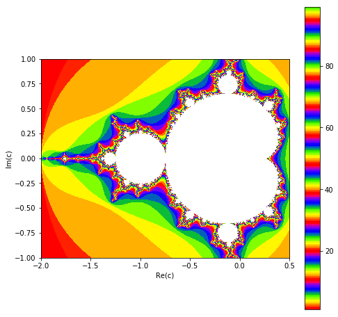

# SESION 3


```python
import numpy as np
import matplotlib.pyplot as plt
```

##  OPERADORES LOGICOS

* Mayor que: >
* Mayor igual que: >=
* Igual: ==
* Menor que: <
* Menor igual que: <=
* y: and, &
* o: or, 

## CONDICIONALES:

```python
if 'condicion':
    statement

if 'condition':
    statement
else:
    statement
    
    
if 'condition':
    statement
    
elif:
    statement
    
else:
    statement
    

```

##  Ejemplo:


```python
## USER AND PASSWORD

log="login"
psswd=12345

input_log = raw_input("Login: ")
input_psswd = input("password: ")

if (log == input_log) & (psswd==input_psswd):
    print('\naccess granted!')
else:
    print('\nwrong password or username!')

```

    Login: user
    password: 123
    
    wrong password or username!


## CICLOS

```python
for 'variable' in 'list or array':
    statement;


while 'condition':
    statement;
    
while 'condition':
    statement;
    break
    statement;
    continue

```

### Ejemplo:


```python
sum = 0
for i in range(8):
    sum = sum + i
    print(sum)
```

    0
    1
    3
    6
    10
    15
    21
    28


```python
for i in range(100):
    print('hola '+str(i))
```

    hola 0
    hola 1
    hola 2
    hola 3
    hola 4
    hola 5
    hola 6
    hola 7
    hola 8
    hola 9
    hola 10
    hola 11
    hola 12
    hola 13
    hola 14
    hola 15
    hola 16
    hola 17
    hola 18
    hola 19
    hola 20
    hola 21
    hola 22
    hola 23
    hola 24
    hola 25
    hola 26
    hola 27
    hola 28
    hola 29
    hola 30
    hola 31
    hola 32
    hola 33
    hola 34
    hola 35
    hola 36
    hola 37
    hola 38
    hola 39
    hola 40
    hola 41
    hola 42
    hola 43
    hola 44
    hola 45
    hola 46
    hola 47
    hola 48
    hola 49
    hola 50
    hola 51
    hola 52
    hola 53
    hola 54
    hola 55
    hola 56
    hola 57
    hola 58
    hola 59
    hola 60
    hola 61
    hola 62
    hola 63
    hola 64
    hola 65
    hola 66
    hola 67
    hola 68
    hola 69
    hola 70
    hola 71
    hola 72
    hola 73
    hola 74
    hola 75
    hola 76
    hola 77
    hola 78
    hola 79
    hola 80
    hola 81
    hola 82
    hola 83
    hola 84
    hola 85
    hola 86
    hola 87
    hola 88
    hola 89
    hola 90
    hola 91
    hola 92
    hola 93
    hola 94
    hola 95
    hola 96
    hola 97
    hola 98
    hola 99


```python
data = np.random.rand(25).reshape((5,5))
print(data)

print()

for i in range(5):
    print(data[i,i])
```

    [[0.41177942 0.76616697 0.02114611 0.9238797  0.7456346 ]
     [0.57257074 0.36914177 0.74493035 0.75516412 0.47740324]
     [0.6010903  0.82103019 0.80169053 0.18381342 0.42746362]
     [0.2108293  0.46588895 0.48389307 0.28273228 0.20359842]
     [0.308563   0.89958165 0.01599051 0.81765653 0.76312874]]
    
    0.41177941977894983
    0.36914177019607963
    0.801690525452275
    0.2827322800655172
    0.7631287356656551


### CICLO WHILE


```python
i=0
while i<10:
    print(i)
    i += 1
```

    0
    1
    2
    3
    4
    5
    6
    7
    8
    9


## Ejemplo:
* Converge la serie?


```python
def sum1(n):
    sum=0
    for i in range(1,n):
        sum += 1./(3.*i - 2.)**(i + 0.5)
    return sum
        
```


```python
sum1(100)
```


    1.032384322161901


## Ejercicio:
Compruebe la convergencia de las siguientes series:

$$
\sum^\infty_{n=1} (-1)^n \tanh n
$$


$$
\sum^\infty_{n=1} \frac{(\tan^{-1} n)^2}{n^2+1}
$$

$$
\sum^\infty_{n=2} \frac{\log_n (n!)}{n^3}
$$

## Ejercicio:
Demuestre numericamente que:
$$
\sum^\infty_{n=1} \frac{n(n+1)}{x^n} = \frac{2x^2}{(1-x)^3}
$$

### Ejemplo:  Random Walk:
A random walk is a mathematical object, known as a stochastic or random process, that describes a path that consists of a succession of random steps on some mathematical space such as the integers. An elementary example of a random walk is the random walk on the integer number line,  $\mathbb{Z}$, which starts at 0 and at each step moves +1 or −1 with equal probability.


```python
nsize=1000
x = np.zeros(nsize)
y = np.zeros(nsize)

for i in range(1,nsize):
    x[i] = i
    prob = np.random.rand()
    if prob<=0.5:
        y[i] = y[i-1] -1.
    else:
        y[i] = y[i-1] + 1.
        
plt.figure()
plt.plot(x,y)
plt.show()
```


## Ejemplo: Conjunto de Mandelbrot


```python
from pylab import *
from numpy import NaN
 
def m(a):
    z = 0
    for n in range(1, 100):
        z = z**2 + a
        if abs(z) > 2:
            return n
    return NaN
 
X = arange(-2, .5, .002)
Y = arange(-1,  1, .002)
Z = zeros((len(Y), len(X)))
 
for iy, y in enumerate(Y):
    for ix, x in enumerate(X):
        Z[iy,ix] = m(x + 1j * y)
figure(figsize=(8,8))
imshow(Z, cmap = plt.cm.prism, interpolation = 'none', extent = (X.min(), X.max(), Y.min(), Y.max()))
xlabel("Re(c)")
ylabel("Im(c)")
colorbar()
savefig("mandelbrot_python.svg")
show()
```





## Write Files: Numpy


```python
x = x.reshape((len(x),1))
y = y.reshape((len(y),1))


data = np.concatenate((x,y),axis=1)
print(data.shape)

np.savetxt('random-walk.tsv',data)
```

    (1000, 2)


## [Libreria OS ](https://docs.python.org/3/library/os.html)
This module provides a portable way of using operating system dependent functionality. If you just want to read or write a file see open(), if you want to manipulate paths, see the os.path module, and if you want to read all the lines in all the files on the command line see the fileinput module. For creating temporary files and directories see the tempfile module, and for high-level file and directory handling see the shutil module.


```python
## comandos del os
os.getcwd()
```


```python

os.listdir('.')
```


```python
os.fchdir("path")
```


```python
os.mkdir("path")
```

## Read Files: 


```python
# Creamos un archivo de texto con dos columnas y varias lineas

file = open('datafile.txt','r')

count=0
for lines in file:
    strings = lines.split(" ")
    print(strings[0]+' '+strings[1])
    count+=1
    
print('total lines: '+str(count))
```

## Read Files: Numpy


```python
newdata = np.loadtxt('random-walk.tsv')
```


```python
x1, x2 = np.loadtxt('random-walk.tsv', usecols=(0,1),unpack=True, delimiter=' ')


plt.figure()
plt.plot(x1,x2)
plt.show()
```

# [Libreria Pandas](https://pandas.pydata.org/)
pandas aims to be the fundamental high-level building block for doing practical, real world data analysis in Python. Additionally, it has the broader goal of becoming the most powerful and flexible open source data analysis / manipulation tool available in any language.
## READ DATAFILE WITH PANDAS


```python
# CREE UN ARCHIVO DE DATOS FORMADO POR COLUMNAS DE DIFERENTES TIPOS DE VARIABLES, STRINGS, INT, FLOATS
import pandas as pd
df = pd.read_csv('datafile2.txt',header=0,sep=" ")
```


```python
df
```


<div>
<style scoped>
    .dataframe tbody tr th:only-of-type {
        vertical-align: middle;
    }

    .dataframe tbody tr th {
        vertical-align: top;
    }

    .dataframe thead th {
        text-align: right;
    }
</style>
<table border="1" class="dataframe">
  <thead>
    <tr style="text-align: right;">
      <th></th>
      <th>#1.nombre</th>
      <th>#2.apellido</th>
      <th>#3.cc</th>
      <th>#4.edad</th>
      <th>#5.hijos</th>
      <th>#6.estado</th>
    </tr>
  </thead>
  <tbody>
    <tr>
      <th>0</th>
      <td>juan</td>
      <td>perez</td>
      <td>12345</td>
      <td>20</td>
      <td>0</td>
      <td>soltero</td>
    </tr>
    <tr>
      <th>1</th>
      <td>sandra</td>
      <td>henao</td>
      <td>5642</td>
      <td>25</td>
      <td>1</td>
      <td>casada</td>
    </tr>
  </tbody>
</table>
</div>


```python
df.iloc[:,0]
```


    0      juan
    1    sandra
    Name: #1.nombre, dtype: object


```python
df.describe()
```


<div>
<style scoped>
    .dataframe tbody tr th:only-of-type {
        vertical-align: middle;
    }

    .dataframe tbody tr th {
        vertical-align: top;
    }

    .dataframe thead th {
        text-align: right;
    }
</style>
<table border="1" class="dataframe">
  <thead>
    <tr style="text-align: right;">
      <th></th>
      <th>#3.cc</th>
      <th>#4.edad</th>
      <th>#5.hijos</th>
    </tr>
  </thead>
  <tbody>
    <tr>
      <th>count</th>
      <td>2.000000</td>
      <td>2.000000</td>
      <td>2.000000</td>
    </tr>
    <tr>
      <th>mean</th>
      <td>8993.500000</td>
      <td>22.500000</td>
      <td>0.500000</td>
    </tr>
    <tr>
      <th>std</th>
      <td>4739.736754</td>
      <td>3.535534</td>
      <td>0.707107</td>
    </tr>
    <tr>
      <th>min</th>
      <td>5642.000000</td>
      <td>20.000000</td>
      <td>0.000000</td>
    </tr>
    <tr>
      <th>25%</th>
      <td>7317.750000</td>
      <td>21.250000</td>
      <td>0.250000</td>
    </tr>
    <tr>
      <th>50%</th>
      <td>8993.500000</td>
      <td>22.500000</td>
      <td>0.500000</td>
    </tr>
    <tr>
      <th>75%</th>
      <td>10669.250000</td>
      <td>23.750000</td>
      <td>0.750000</td>
    </tr>
    <tr>
      <th>max</th>
      <td>12345.000000</td>
      <td>25.000000</td>
      <td>1.000000</td>
    </tr>
  </tbody>
</table>
</div>


```python
df2 = pd.DataFrame({'lista':np.linspace(1,100,200)}) 
df2.head(3)
```


<div>
<style scoped>
    .dataframe tbody tr th:only-of-type {
        vertical-align: middle;
    }

    .dataframe tbody tr th {
        vertical-align: top;
    }

    .dataframe thead th {
        text-align: right;
    }
</style>
<table border="1" class="dataframe">
  <thead>
    <tr style="text-align: right;">
      <th></th>
      <th>lista</th>
    </tr>
  </thead>
  <tbody>
    <tr>
      <th>0</th>
      <td>1.000000</td>
    </tr>
    <tr>
      <th>1</th>
      <td>1.497487</td>
    </tr>
    <tr>
      <th>2</th>
      <td>1.994975</td>
    </tr>
  </tbody>
</table>
</div>


```python
df2.dtypes
```


    lista    float64
    dtype: object


## [Clases](https://docs.python.org/3/tutorial/classes.html)
El mecanismo de clases de Python agrega clases al lenguaje con un mínimo de nuevas sintaxis y semánticas. Es una mezcla de los mecanismos de clase encontrados en C++ y Modula-3. Como es cierto para los módulos, las clases en Python no ponen una barrera absoluta entre la definición y el usuario, sino que más bien se apoya en la cortesía del usuario de no “forzar la definición”. Sin embargo, se mantiene el poder completo de las características más importantes de las clases: el mecanismo de la herencia de clases permite múltiples clases base, una clase derivada puede sobreescribir cualquier método de su(s) clase(s) base, y un método puede llamar al método de la clase base con el mismo nombre. Los objetos pueden tener una cantidad arbitraria de datos.


```python
class objeto:
    """
    Notas para manual de referencia
    """
    def __init__(self, name,age,gender):
        self.name = name
        self.age = age
        self.gender = gender
    def func(self):
        print('hola mundo')

```


```python
?objeto
```


```python
x.name
```


```python
x.age
```
